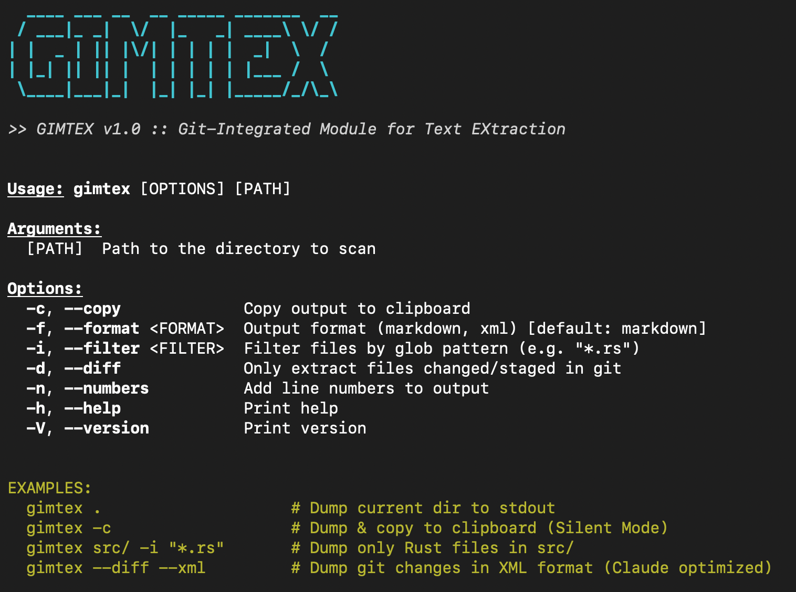

<div align="center">



# GIMTEX
### Git-Integrated Module for Text EXtraction


> **"The Ultimate Bridge Between Code and AI."**
> 
> *Gimtex converts your entire project into a highly optimized, clean, and safe context payload for LLMs (ChatGPT, Claude, deepseek) in milliseconds.*

</div>

---

## Why Gimtex?

Manually copy-pasting code files into ChatGPT is slow, error-prone, and leaks secrets.
**Gimtex** solves this by automating the entire "Context Extraction" pipeline:

| Feature | Description |
| :--- | :--- |
| **Remote Scout** | Clone & scan **any public Git repo** URL directly without local clutter. |
| **Interactive Mode** | **Cherry-pick** files via a TUI checkbox menu (`-I`) before generating context. |
| **Active Defense** | Automatically **redacts API keys**, secrets, and passwords from the output. |
| **Global IO** | Save context directly to a file (`-o context.md`) or copy to clipboard (`-c`). |
| **Smart Pruning** | Hardcoded ignores for `node_modules`, `.git`, `target`, `dist`, etc. |
| **Git Intelligence** | Use `--diff` to extract **only changed files** for targeted debugging. |
| **Tokenomics** | Live **Token Counter** (GPT-4 optimized) for every file processed. |
| **Blazingly Fast** | Written in **Rust** with **Rayon** parallel processing. Scans huge repos in ms. |

---

## Installation

### Via Cargo (Recommended)
Ensure you have Rust installed, then run:

```bash
cargo install --path .
```

*Verify installation:*
```bash
gimtex --version
# gimtex 2.6.0
```

---

## Usage Guide

### 1. The "Standard" Scan
Dump the current directory (recursively) to stdout. Respects `.gitignore`.
```bash
gimtex .
```

### 2. The "God Mode" (Interactive) or script kiddie mode
Launch a Terminal UI to manually toggle which files you want to include.
```bash
gimtex -I
```

### 3. Remote Scout (GitHub/GitLab)
Clone a remote repository to a temp folder, scan it, and print the context.
```bash
# Clone & Scan
gimtex https://github.com/rust-lang/rust-by-example

# Clone & Interactive Pick
gimtex https://github.com/rust-lang/rust-by-example -I
```

### 4. Output Management
Stop piping to files manually. Use the built-in IO flags.
```bash
# Save to file
gimtex src/ -o context.md

# Copy to System Clipboard
gimtex src/ -c
```

### 5. Precision & Safety
```bash
# Filter: Only scan Rust files
gimtex -i "*.rs"

# Diff: Only scan raw changes (Staged + Modified)
gimtex --diff

# Max Size: Increase limit to 500KB (Default 100KB)
gimtex --max-size 500000

# Numbers: Add line numbers for debugging references
gimtex src/main.rs -n
```

---

## Configuration

Gimtex is zero-config by default, but you can add a `gimtex.toml` to your project root for persistent settings.

**gimtex.toml**
```toml
# Currently supported:
ignore = [
    "*.log",
    "temp/",
    "legacy_code/"
]
```

*(More config options coming in v3.0)*

---

## Architecture

- **Engine**: Rust (2021 Edition)
- **Parallelism**: Rayon (Work-Stealing Iterator)
- **Tokenizer**: `tiktoken-rs` (cl100k_base)
- **Parser**: `syn` / `serde` / `toml` / `regex`
- **UI**: `dialoguer` / `indicatif` / `colored`

---

## License

This project is licensed under the MIT License - see the [LICENSE](LICENSE) file for details.