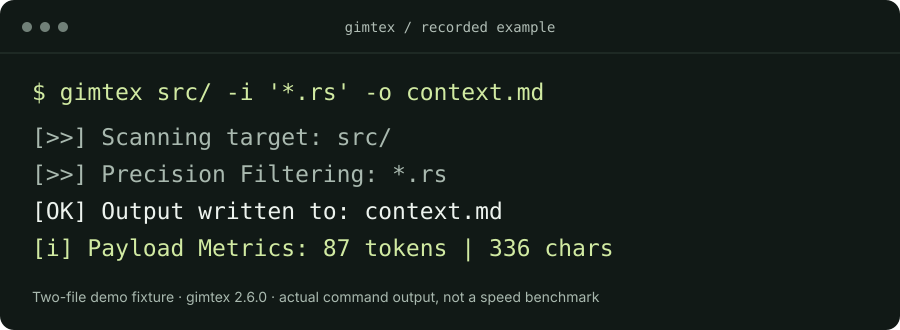

# gimtex

**Turn a codebase into useful context.**

A Rust CLI for selecting source files and preparing Markdown or XML for LLM workflows. Includes interactive selection, Git-diff extraction, token counts, and pattern-based secret redaction.



The preview shows actual output from a two-file demo fixture. The 87-token payload describes that fixture only; it is not a speed benchmark. [Reproduce the example](https://github.com/feboyfierlyan/feboyfierlyan/blob/main/projects/gimtex.md).

## Quick start

Install [Rust and Cargo](https://www.rust-lang.org/tools/install), then:

```sh
git clone https://github.com/feboyfierlyan/gimtex.git
cd gimtex
cargo install --path .
gimtex --version
```

From the project you want to inspect:

```sh
# Export selected Rust files to Markdown.
gimtex src/ -i '*.rs' -o context.md

# Choose files interactively.
gimtex . -I

# Extract files identified by Git's diff.
gimtex . --diff -o changes.md

# Include line numbers or use XML output.
gimtex src/ -n -o context.md
gimtex src/ -f xml -o context.xml
```

`-i` filters paths with a glob; `-I` opens the interactive picker. Running `gimtex` without a path or mode prints help.

## What it does

- Walks the source tree, applying ignore rules and a per-file size limit (100,000 bytes by default).
- Lets you narrow the input with glob filters, Git changes, or an interactive picker.
- Emits a file tree, source contents, and token counts using `cl100k_base`.
- Writes to stdout, a file (`-o`), or the clipboard (`-c`).
- Matches and redacts some common secret patterns.
- Can shallow-clone a supplied repository URL into a temporary directory before scanning it.

```sh
# Scan a public repository. Requires Git.
gimtex https://github.com/rust-lang/rust-by-example -I

# Copy output to the clipboard.
gimtex src/ -c

# Increase the per-file limit to 500,000 bytes.
gimtex src/ --max-size 500000
```

## How it works

[`src/main.rs`](src/main.rs) handles CLI arguments, optional configuration loading, and temporary clones. [`src/scanner.rs`](src/scanner.rs) handles traversal, selection, redaction, token counting, the file tree, and output.

The implementation uses `clap`, `ignore`, `glob`, `regex`, `tiktoken-rs`, `dialoguer`, and `arboard`. File paths are sorted before processing so the output order is deterministic.

## Current limits

- **Review before sharing.** Secret detection is pattern-based and will miss formats outside its rules. It does not certify that output is safe to publish.
- **Token counts depend on the tokenizer.** `cl100k_base` is an estimate for workflows using other tokenizers.
- **Configuration is partial.** `gimtex.toml` and its `ignore` list are parsed and logged, but those custom ignore patterns are not yet passed to the scanner.
- **Performance depends on the input.** No comparative speed claim is made here; this repository does not currently include a benchmark suite.

## Development

```sh
cargo build
cargo run -- --help
```

[More projects by Boy](https://github.com/feboyfierlyan) · [Portfolio](https://feboyfierlyan.com/)
