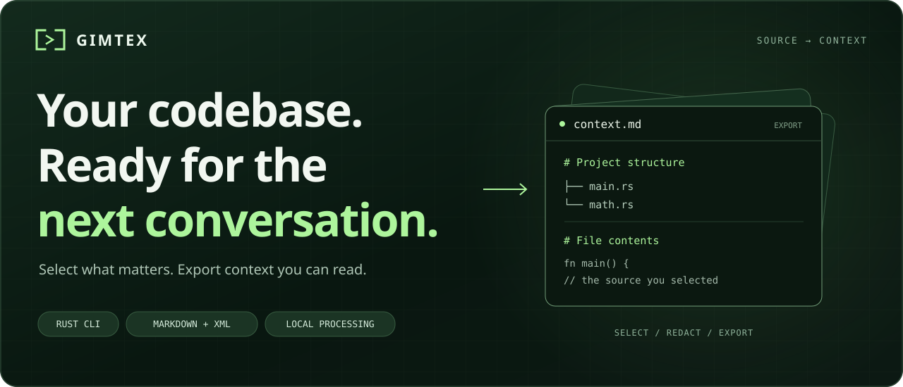
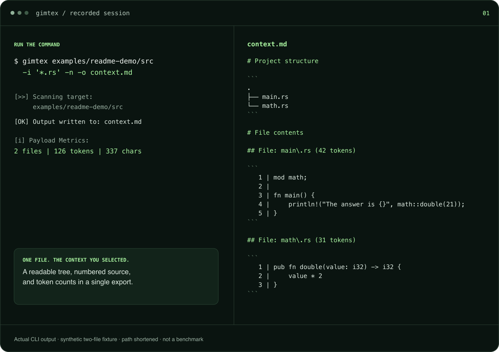
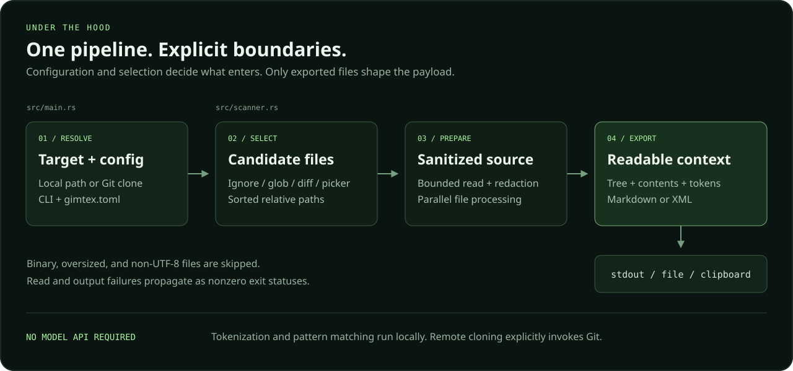

<p align="center">
  
</p>

<p align="center">
  <a href="https://github.com/feboyfierlyan/gimtex/actions/workflows/ci.yml"></a>
  <a href="Cargo.toml"></a>
  <a href="https://www.rust-lang.org/tools/install"></a>
  <a href=".github/workflows/ci.yml"></a>
</p>

<p align="center">
  <strong>Turn the files you choose into context you can actually read.</strong><br />
  Git-aware selection. Markdown or XML. Local token counting. One CLI.
</p>

<p align="center">
  <a href="#quick-start">Quick start</a> ·
  <a href="#see-it-in-action">Demo</a> ·
  <a href="docs/usage.md">Usage guide</a> ·
  <a href="docs/architecture.md">Architecture</a> ·
  <a href="CONTRIBUTING.md">Contributing</a>
</p>

---

## A better starting point for your next prompt

A useful code conversation needs the right files, their structure, and enough
context to connect them. Gimtex packages that material into a single readable
export for code reviews, debugging sessions, onboarding, and LLM workflows.

Choose a folder, a glob, your Git changes, or individual files. Gimtex prepares a
file tree and source contents, applies pattern-based secret redaction, counts
tokens locally, and writes Markdown or XML to your terminal, a file, or the
clipboard. **No model account or API key is required.**

- **Choose the scope.** Combine ignore rules, path filters, Git diff, and an interactive picker.
- **Keep the structure.** Export relative paths, a file tree, and optional line numbers alongside the source.
- **Know what you are sending.** See file counts and `cl100k_base` token counts before using the context elsewhere.
- **Fit your workflow.** Use readable Markdown, parseable XML, a saved file, or clipboard output.
- **Start from a URL.** Shallow-clone a repository into a temporary directory and scan it with the same pipeline.

## See it in action



<sub>Captured from the real CLI and rendered for readability. The scan path is shortened; output and metrics are unchanged. These counts describe this fixture only.</sub>

[Read the exported context](docs/media/demo-context.md) ·
[View the terminal transcript](docs/media/demo-transcript.txt) ·
[Reproduce the image](examples/readme-demo/README.md)

## Quick start

### 1. Install from source

Install [Rust and Cargo](https://www.rust-lang.org/tools/install) and Git, then:

```sh
git clone https://github.com/feboyfierlyan/gimtex.git
cd gimtex
cargo install --locked --path .
gimtex --version
```

This installs the binary in Cargo's bin directory. Make sure that directory is on
your `PATH` (`$HOME/.cargo/bin` on Unix, `%USERPROFILE%\.cargo\bin` on Windows).

### 2. Export your first context

From the project you want to inspect:

```sh
gimtex src/ -i '*.rs' -n -o context.md
```

Open `context.md` to review the selected file tree, numbered source, and per-file
token counts. Diagnostics and total payload metrics appear on stderr.

### 3. Pick the files yourself

```sh
gimtex . -I -o context.md
```

Use **↑ / ↓** to move, **Space** to toggle a file, and **Enter** to confirm.
Candidates start selected. Selecting none exits without writing or copying.

> Running `gimtex` with no arguments prints help. Supplying an option without a
> path, such as `gimtex -i '*.rs'`, scans the current directory.

## A few workflows worth keeping

### Review the code you changed

```sh
gimtex . --diff -n -o changes.md
```

Extract tracked working-tree and staged changes against `HEAD`, scoped to the
selected path. Deleted and untracked files are omitted; staged additions also
work before the first commit.

### Share only one part of a project

```sh
gimtex /path/to/project -i 'src/*.rs' -o source-context.md
```

Filters are relative to the target. A filename pattern such as `*.rs` also
matches nested files.

### Use XML in a downstream tool

```sh
gimtex src/ -f xml -o context.xml
```

The export is one escaped `<codebase>` document containing structure, file
contents, and token attributes. [See the output contract →](docs/output-format.md)

### Explore a remote repository

```sh
gimtex https://github.com/rust-lang/rust-by-example -I -o context.md
```

Git handles the shallow clone and authentication. The temporary clone is removed
when the command finishes. Gimtex does not require a model API.

### Save and copy the same context

```sh
gimtex src/ -o context.md -c
```

File and clipboard output can be combined. A clipboard failure returns an error;
an already written file remains available.

[All options, configuration, and troubleshooting →](docs/usage.md)

## Make the selection yours

Put `gimtex.toml` in the directory you are scanning:

```toml
ignore = [
  "private/",
  "*.log",
  "!keep.log",
]
```

Custom rules use gitignore syntax and apply to both regular and diff scans.
Configuration is target-local: scanning a different directory uses that
directory's `gimtex.toml`, not the caller's. A single-file scan uses its parent
folder; a remote scan uses the clone's root.

Gimtex also respects standard ignore behavior and prunes common generated
subdirectories such as `node_modules`, `target`, and `dist`.
[Read the precise selection rules →](docs/usage.md#file-selection-rules)

## Inside Gimtex



The implementation has two main modules:

- [`src/main.rs`](src/main.rs) owns CLI parsing, target resolution, temporary clones, and configuration loading.
- [`src/scanner.rs`](src/scanner.rs) owns discovery, selection, bounded reads, redaction, formatting, token counts, and output delivery.

File paths are sorted before parallel processing. Only files actually exported
appear in the tree and counts, and dependency summaries come from included,
sanitized manifests.

[Explore the pipeline, dependency choices, and failure behavior →](docs/architecture.md)

## Built to be checked

[CI](https://github.com/feboyfierlyan/gimtex/actions/workflows/ci.yml) runs formatting,
Clippy, regression tests, release builds, and an independent XML parser on
**Linux, macOS, and Windows**.

Regression fixtures cover Git path scoping, renames and unusual filenames,
ignore rules, repeated exports, secret redaction, binary/size limits, token
accounting, and simulated remote-clone success and failure. Tests use local
temporary files and do not modify the system clipboard.

```sh
cargo test --locked
cargo fmt --check
cargo clippy --locked --all-targets -- -D warnings
```

[Development and contribution guide →](CONTRIBUTING.md)

## Know the boundaries

- **Redaction is a review aid.** It matches known patterns and can miss secrets or redact ordinary values. Review an export before sharing it.
- **Tokens depend on the tokenizer.** Counts use `cl100k_base`; another model's tokenizer may produce different counts.
- **Text goes in, text comes out.** Oversized files, files containing NUL bytes, and non-UTF-8 contents are skipped with a diagnostic. The default per-file limit is **100,000 bytes**; adjust it with `--max-size`.
- **Clipboard behavior is platform-dependent.** It requires an available clipboard service; persistence after exit on Linux depends on that service.
- **No speed claims.** Parallel file preparation is part of the implementation, but the repository does not yet include a benchmark suite.

<details>
<summary><strong>Does Gimtex send my source code to an AI service?</strong></summary>

No model API is called. File processing, secret-pattern matching, and token
counting happen locally. Supplying a repository URL invokes Git to clone it;
installation may also download build dependencies. You decide where an exported
file or copied context goes next.

</details>

<details>
<summary><strong>Why is a file missing from my export?</strong></summary>

Check the selected path, hidden/ignore rules, custom config, glob filter,
`--diff` scope, interactive selection, and per-file size limit. Binary and
non-UTF-8 files are skipped; diagnostics explain those exclusions. With
`--diff`, untracked files are not included. See the
[troubleshooting guide](docs/usage.md#troubleshooting).

</details>

<details>
<summary><strong>Can I run the same export command twice?</strong></summary>

Yes. With `-o`, the output destination is excluded from scanning, so an old
export does not become input to the next one. The complete new payload is
prepared before replacing the destination. Prefer `-o context.md` over shell
redirection into the scanned directory.

</details>

---

<p align="center">
  Built by <a href="https://github.com/feboyfierlyan">Boy</a>.<br />
  <a href="https://github.com/feboyfierlyan/gimtex/issues/new/choose">Report a bug or suggest a feature</a> ·
  <a href="CONTRIBUTING.md">Contribute</a> ·
  <a href="https://feboyfierlyan.com/">More projects</a>
</p>
