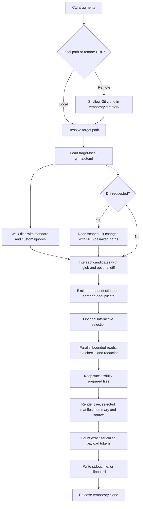

# Architecture

[← README](../README.md) · [Usage](usage.md) · [Output format](output-format.md)

Gimtex is a synchronous Rust CLI with parallel file preparation. It resolves one
target, applies explicit selection rules, prepares text, and emits one payload.
There is no model API integration, server, background index, or hosted backend
in this codebase.


## Pipeline



The graph describes responsibilities rather than concurrent scheduling. Git
change discovery and directory traversal both finish before interactive
selection. Read/redaction work uses Rayon; output rendering follows the sorted
file order.

## Module boundaries

### `src/main.rs` — command and target lifecycle

[`Args`](../src/main.rs) defines the CLI through `clap`. `OutputFormat` constrains
format values to Markdown or XML. With no arguments the program prints help;
options without a target use the current directory.

`is_remote` recognizes supported URL prefixes. Existing local paths take
precedence. Remote scanning invokes `git clone --depth 1 -- …` in a temporary
directory; the temporary-directory handle remains in scope through extraction.
Clone errors propagate instead of returning success.

After canonicalizing the target, `load_config` reads `gimtex.toml` from the
selected directory, or a single file's parent. Serde/TOML validates the config;
unknown keys are rejected. `main` then calls the scanner with the resolved path,
CLI settings, and config.

### `src/scanner.rs` — selection, preparation, and output

[`scan`](../src/scanner.rs) coordinates the export. Its main building blocks are:

- **`get_walk_files`** — Walks eligible regular files, applies standard ignore behavior and custom directory pruning, and avoids discovered symlinks.
- **`get_git_files`** — Runs Git in the target working tree. It uses target-relative, NUL-delimited names so spaces, Unicode, and newlines do not become parsing boundaries. Staged additions work without an initial commit.
- **`process_file`** — Checks regular-file metadata, bounds the read to the configured limit plus one byte, rejects NUL/non-UTF-8 content, and applies secret-pattern redaction.
- **`SecretScanner`** — Redacts selected assignment patterns, provider-key patterns, and private-key blocks. It is a pattern matcher, not a proof that an export contains no secrets.
- **`scan_dependencies`** — Builds optional project summaries from included, sanitized root `Cargo.toml` and `package.json` files. Excluded manifests cannot contribute hidden metadata.
- **`render_output`** — Creates a file tree and source blocks, optional line numbers, Markdown fences or escaped XML, and per-file token attributes/labels.
- **`write_output`** — Writes the finished payload into a temporary file in the destination directory before replacing the destination.

## Why these dependencies are here

- **`clap`** parses and validates command-line options.
- **`ignore` + `glob`** handle traversal/ignore rules and the explicit file filter.
- **`dialoguer`** provides the terminal file picker.
- **`rayon`** prepares selected files in parallel while preserving collected order.
- **`regex`** implements the current secret-pattern rules.
- **`tiktoken-rs`** provides local `cl100k_base` token counting.
- **`serde`, `toml`, `serde_json`** parse config and selected manifests.
- **`tempfile`** owns temporary clones and completed file exports.
- **`arboard`** writes text to the OS clipboard.
- **`colored` + `indicatif`** style diagnostics and clone progress; they do not add terminal styling to exported payloads.

Exact dependency constraints and resolved versions are in
[`Cargo.toml`](../Cargo.toml) and [`Cargo.lock`](../Cargo.lock).

## Behavioral guarantees and their scope

**Ordering.** Candidate paths are sorted before parallel work. Included files and
tree children are emitted in a stable order for unchanged input/settings. The
filesystem is not snapshotted; concurrent source edits can change what is read.

**Limits.** The default cap is per file, not a total memory or total token budget.
The bounded read also catches growth after the metadata check. Prepared content
and the final payload are kept in memory; a repository with many eligible files
can still produce a large export.

**Selection consistency.** Trees, file counts, and project summaries describe
included files. Large/binary/non-UTF-8 candidates do not remain in the tree after
being skipped.

**Output integrity.** The designated `-o` destination is excluded from selection.
The full payload is prepared before replacement. This is not a disk durability
or concurrent-writer guarantee; it avoids truncating an existing export during
normal payload preparation.

**Source handling.** File preparation reads source without editing it. The
explicit `-o` destination is replaced during delivery. Discovered symlinks are skipped, but the scanner is not a security sandbox against a process
concurrently replacing files. Pattern-based redaction has both false negatives
and false positives.

**Exit status.** Invalid input/configuration, Git failures, read/traversal errors,
and failed output destinations propagate as errors. Expected file skips and an
empty interactive selection are successful outcomes.

## Test strategy

[`tests/cli.rs`](../tests/cli.rs) drives the compiled executable through temporary
fixtures and local Git repositories. Unit tests inside the source modules cover
redaction, XML escaping, line numbering, tokenizer literals, and CLI behavior.
Platform-specific cases are gated: for example, the raw non-UTF-8 filename test
runs on Linux because the macOS filesystem used during development rejects
creating that fixture.

The [CI workflow](../.github/workflows/ci.yml) runs on Linux, macOS, and Windows:
formatting → Clippy → tests → release build → XML parsing with Python's standard
library. Remote-clone tests use a local shim, and automated tests do not write to
the system clipboard. Clipboard services, real network authentication, and
interactive terminals also benefit from environment-specific smoke testing.

## Repository map

```text
gimtex/
├── src/
│   ├── main.rs                 CLI, config, and target lifecycle
│   └── scanner.rs              Extraction pipeline and rendering
├── tests/cli.rs                End-to-end CLI regression fixtures
├── docs/                      Usage, output contract, and architecture
│   └── media/                 Captured demo transcript and payload
├── examples/readme-demo/       Reproducible two-file input
├── assets/readme/              Banner, diagram, and demo images
├── scripts/                    Demo rendering utility
├── .github/                    CI and contribution templates
├── Cargo.toml
└── Cargo.lock
```
